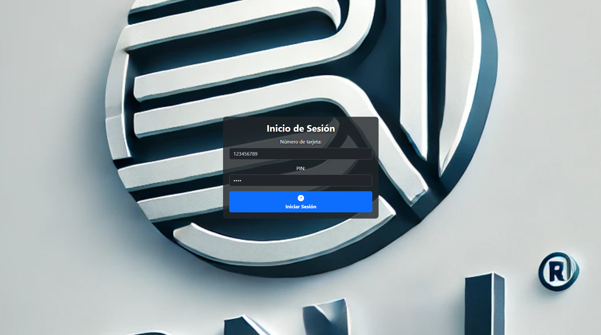
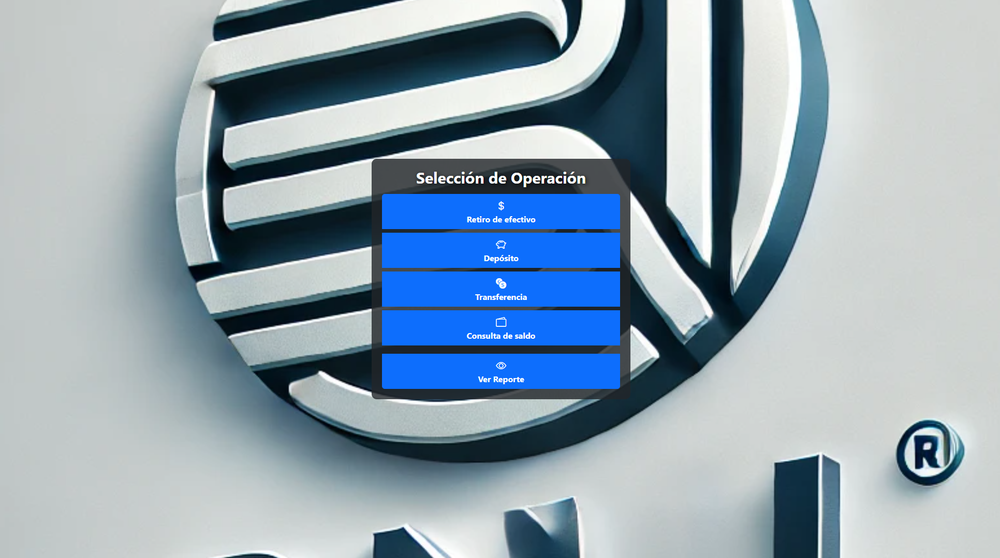
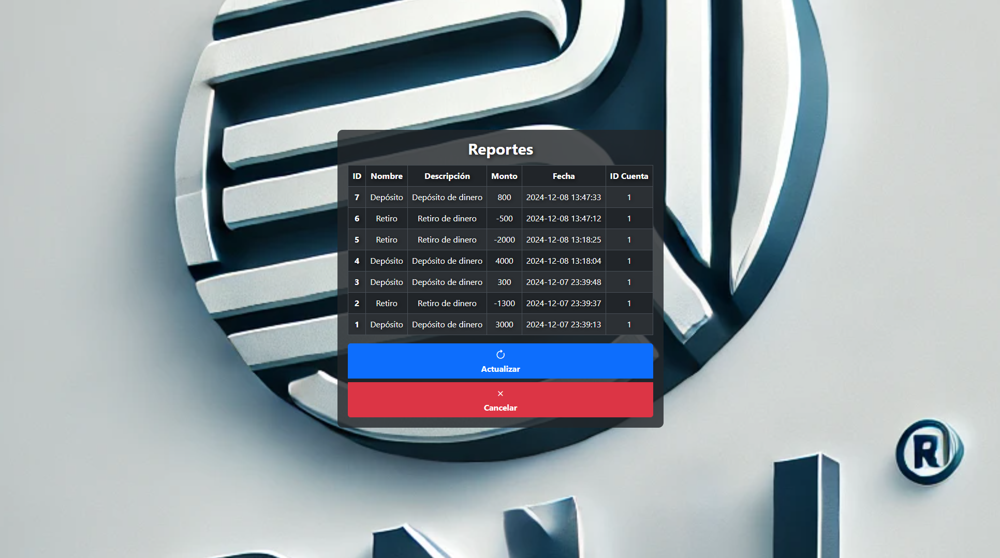

# Cajero Automatico BNL
### Para Lab. Programación 3

#### El Cajero actualmente tiene las siguientes tecnologias aplicadas:

```shell
1. PHP          # Encargado de todo lo relacionado con la interaccion de la DB
2. MySQL        # La base de datos (phpmyadmin)
3. JQuery       # Para facilidad con el uso de las peticiones a PHP sin recargar la web.
4. Bootstrap    # Para los estilos de la web
5. Ajax         # Encargado de realizar la iteraccion con el server de php.
```

#### El cajero hasta ahora realiza las siguientes acciones:
```shell
1. Pantalla de Bienvenida                       # Esta pantalla funciona por completo
2. Menu de Insertar la tarjeta:
    2.1 Pantalla de Login                       # Esta pantalla funciona por completo
    2.2 Retiro de efectivo                      # Esta pantalla funciona por completo
    2.3 Depósito                                # Esta pantalla funciona por completo
    2.4 Transferencia                           # Esta pantalla funciona por completo
    2.5 Consulta de saldo                       # Esta pantalla funciona por completo
    2.6 Ver reportes                            # Esta pantalla funciona por completo
3. Administrador (Actualmente no disponible)    # Esta pantalla funciona por completo
    3.1 Registro de Efectivo                    # Esta pantalla funciona por completo
    3.2 Reportes                                # Esta pantalla funciona por completo
```

#### Mejoras [16/12/2024]
```shell
1. El Administrador ya esta completo
2. Mejoras en el flujo.
3. Boton para Cerrar Sesión
4. Boton para volver atras en el login (Admin y Tarjeta)
```

#### Mejoras [14/12/2024]
```shell
1. Se agrego control de tokens (para la seguridad)
2. Ventanas modales para los errores y mensajes de alerta.
3. Administrador (pendiente...)
```


## Imagenes de Muestra





## Proyecto en proceso...